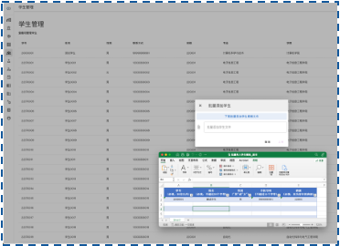
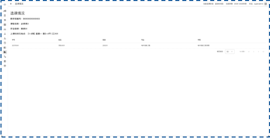

# 系统实现报告

**22371345贾博驿†、22373333董和军†, 22373305曾文轩†**

[TOC]

**本项目已经实现在线部署，可通过下方链接访问**

https://ecs.1230123.xyz:20080/

## 一、实现环境

前端使用Vue.js、Vue Router、Pinia和Vuetify作为主要框架。

| 名称       | 版本   |
| ---------- | ------ |
| Vue.js     | 3.5.11 |
| Vue Router | 4.4.5  |
| Pinia      | 2.2.6  |
| Vuetify    | 3.7.4  |

后端使用Python和FastAPI，并部署至阿里云ECS

| 名称    | 版本    |
| ------- | ------- |
| Conda   | 24.9.2  |
| Python  | 3.10.15 |
| FastAPI | 0.115.5 |
| Nginx   | 1.18.0  |
| Ubuntu  | 22.04   |

数据库使用MySQL和Redis

| 名称  | 版本   |
| ----- | ------ |
| MySQL | 8.0.40 |
| Redis | 6.0.16 |

## 二、系统功能结构图


## 三、基本表的定义，主外码等完整性约束定义，索引的定义

### 1. 登录信息

#### （1）登录信息表

```
login_table (login_id, login_password, login_role, login_is_enable)
```

- 主键
  - `login_id`

### 2. 用户信息

#### （2）学生信息表

```
student_table (student_id, student_name, student_gender, student_phone, student_class_id)
```

- 主键
  - `student_id`
- 外键
  - `student_id` 依赖于 `login_table` 的 `login_id`
  - `student_class_id` 依赖于 `class_table` 的 `class_id`

#### （3）教师信息表

```
teacher_table (teacher_id, teacher_name, teacher_gender, teacher_phone, teacher_department_id)
```

- 主键
  - `teacher_id`
- 外键
  - `teacher_id` 依赖于 `login_table` 的 `login_id`
  - `teacher_department_id` 依赖于 `department_table` 的 `department_id`

#### （4）学院教务信息表

```
faculty_table (faculty_id, faculty_name, faculty_gender, faculty_phone, faculty_department_id)
```

- 主键
  - `faculty_id`
- 外键
  - `faculty_id` 依赖于 `login_table` 的 `login_id`
  - `faculty_department_id` 依赖于 `department_table` 的 `department_id`

### 3. 组织信息

#### （5）院系信息表

```
department_table (department_id, department_name)
```

- 主键
  - `department_id`

#### （6）专业信息表

```
major_table (major_id, major_name, major_department_id)
```

- 主键
  - `major_id`
- 外键
  - `major_department_id` 依赖于 `teacher_table` 的 `department_id`

#### （7）班级信息表

```
class_table (class_id, class_major_id, class_headmaster_id)
```

- 主键
  - `class_id`
- 外键
  - `class_major_id` 依赖于 `major_table` 的 `major_id`
  - `class_headmaster_id` 依赖于 `teacher_table` 的 `teacher_id`

### 4. 课程信息

#### （8）课程信息表

```
course_table (course_id, course_name, course_type, course_credit, course_hours, course_teacher_id, course_plan_filename, course_status)
```

- 主键
  - `course_id`
- 外键
  - `course_teacher_id` 依赖于 `teacher_table` 的 `teacher_id`

#### （9）学期信息表

```
semester_table (semester_id, semester_name)
```

- 主键
  - `semester_id`

#### （10）教学班信息表

```
curriculum_table (curriculum_id, curriculum_course_id, curriculum_teacher_id, curriculum_semester_id, curriculum_capacity, curriculum_info)
```

- 主键
  - `curriculum_id`
- 外键
  - `curriculum_course_id` 依赖于 `course_table` 的 `course_id`
  - `curriculum_teacher_id` 依赖于 `teacher_table` 的 `teacher_id`
  - `curriculum_semester_id` 依赖于 `semester_table` 的 `semester_id`

#### （11）场地信息表

```
place_table (place_id, place_name, place_is_enable)
```

- 主键
  - `place_id`

#### （12）场地资源信息表

```
resource_table (resource_id, resource_place_id, resource_time)
```

- 主键
  - `resource_id`
- 外键
  - `resource_place_id` 依赖于 `place_table` 的 `place_id`

#### （13）场地资源使用信息表

```
utilization_table (utilization_curriculum_id, utilization_resource_id)
```

- 主键
  - `utilization_curriculum_id`
  - `utilization_resource_id`
- 外键
  - `utilization_curriculum_id` 依赖于 `curriculum_table` 的 `curriculum_id`
  - `utilization_resource_id` 依赖于 `resource_table` 的 `resource_id`

#### （14）场地资源使用字符串缓存表

```
curriculum_utilization_string_table (curriculum_id, curriculum_utilization_string)
```

- 主键
  - `curriculum_id`
- 外键
  - `curriculum_id` 依赖于 `curriculum_table` 的 `curriculum_id`

### 5. 选课信息

#### （15）选课信息表

```
attendance_table (attendance_student_id, attendance_curriculum_id, attendance_score, attendance_evaluation)
```

- 主键
  - `attendance_student_id`
  - `attendance_curriculum_id`
- 外键
  - `attendance_student_id` 依赖于 `student_table` 的 `student_id`
  - `attendance_curriculum_id` 依赖于 `curriculum_table` 的 `curriculum_id`

#### （16）预选信息表

```
choice_table (choice_student_id, choice_curriculum_id, choice_order, choice_introduction)
```

- 主键
  - `choice_student_id`
  - `choice_curriculum_id`
- 外键
  - `choice_student_id` 依赖于 `student_table` 的 `student_id`
  - `choice_curriculum_id` 依赖于 `curriculum_table` 的 `curriculum_id`

### 6. 审计信息

#### （17）登录审计信息表

```
login_audit_table (login_audit_id, login_audit_claim, login_audit_time, login_audit_result)
```

- 主键
  - `login_audit_id`

#### （18）选课审计信息表

```
selection_audit_table (selection_audit_id, selection_audit_student_id, selection_audit_curriculum_id, selection_audit_type, selection_audit_time, selection_audit_operator_id)
```

- 主键
  - `selection_audit_id`
- 外键
  - `selection_audit_student_id` 依赖于 `student_table` 的 `student_id`
  - `selection_audit_curriculum_id` 依赖于 `curriculum_table` 的 `curriculum_id`
  - `selection_audit_operator_id` 依赖于 `login_table` 的 `login_id`

## 四、系统的安全性设计，不同人员的外模式及相关权限

数据库系统根据使用者的角色，分为了**admin**、**faculty**、**teacher**、**student**四种用户

### 1. admin 用户

代表系统管理员，拥有所有表的查询和修改权限

### 2. faculty 用户

代表学院教务，拥有登录信息表、用户信息系列表、课程信息系列表、选课信息系列表、审计信息系列表的查询和修改权限，组织信息系列表的查询权限

### 3. teacher 用户

代表教师，拥有登录信息表、教师信息表、课程信息表、教学班信息表、选课信息表、审计信息系列表的查询和修改权限，学生信息表、组织信息系列表、学期信息表、场地信息表、场地资源信息表、场地资源使用信息表、预选信息表的查询权限

### 4. student 用户

代表学生，拥有登录信息表、学生信息表、选课信息系列表、审计信息系列表的查询和修改权限，组织信息系列表、课程信息系列表、审计信息系列表的查询权限

## 五、存储过程、触发器和函数的代码说明

### 1. 存储过程

#### 选课抽签的存储过程 —— drawingCourse

定义了drawingCourse存储过程，来完成整个选课的抽签的全部过程，抽签的逻辑为对于某一课程在某一学期的所有教学班，对学生的预选，根据学生预选的志愿顺序，进行抽签，参数为p_course_id（抽签的课程）和p_semester_id（抽签的学期）

在存储过程的代码中，通过定义**游标`CURSOR`**来实现对待抽签的教学班`curriculum`和预选信息`choice`进行遍历，并且通过在定义遍历预选信息`choice`的游标的时候引入`ORDER BY RAND()`来实现随机，实现随机抽签选课

```sql
CREATE DEFINER=`root`@`%` PROCEDURE `drawingCourse`(IN p_course_id CHAR(24), IN p_semester_id INT)
BEGIN
    DECLARE done INT DEFAULT 0;
    DECLARE current_order INT DEFAULT 1;
    DECLARE current_curriculum_id INT;
    DECLARE current_capacity INT;
    DECLARE current_selected INT;
    DECLARE current_student_id INT;
    DECLARE delete_num INT;

    DECLARE curriculum_cursor CURSOR FOR 
    SELECT curriculum_id, curriculum_capacity
    FROM curriculum_table
    WHERE curriculum_course_id = p_course_id AND curriculum_semester_id = p_semester_id;


    DECLARE delete_cursor CURSOR FOR
    SELECT choice_student_id
    FROM choice_table
    WHERE choice_curriculum_id = current_curriculum_id AND choice_order = current_order
    ORDER BY RAND()
    LIMIT delete_num;

    DECLARE CONTINUE HANDLER FOR NOT FOUND SET done = 1;
 
    loop_order: LOOP
      
   
      OPEN curriculum_cursor;
      loop_curriculum: LOOP
        FETCH curriculum_cursor INTO current_curriculum_id, current_capacity;

        IF done THEN
          SET done = 0;
          CLOSE curriculum_cursor;
          LEAVE loop_curriculum;
        END IF; 

        SELECT COUNT(*) INTO current_selected
        FROM attendance_table
        WHERE attendance_curriculum_id = current_curriculum_id;

        SET delete_num = current_capacity - current_selected;


        OPEN delete_cursor;
        loop_delete: LOOP
          FETCH delete_cursor INTO current_student_id;

          IF done THEN
            SET done = 0;
            CLOSE delete_cursor;
            LEAVE loop_delete;
          END IF;

          INSERT INTO attendance_table (attendance_student_id, attendance_curriculum_id)
          VALUES (current_student_id, current_curriculum_id);

          INSERT INTO selection_audit_table (selection_audit_student_id, selection_audit_curriculum_id, selection_audit_type, selection_audit_operator_id)
          VALUES (current_student_id, current_curriculum_id, 2, "superadmin");

          DELETE FROM choice_table
          WHERE choice_student_id = current_student_id AND choice_curriculum_id = current_curriculum_id; 


        END LOOP loop_delete;

      END LOOP loop_curriculum;

      IF current_order >= 5 THEN
        LEAVE loop_order; 
      END IF;
      
      SET current_order = current_order + 1;

    END LOOP loop_order;


END
```

### 2. 触发器

#### 触发器 —— generate

定义在`place_table`中，定义语句为

```sql
CREATE DEFINER = `root`@`%` TRIGGER `data`.`generate` AFTER INSERT ON `Untitled` FOR EACH ROW CALL GenerateResource(NEW.place_id);
```

含义即，当`place_table`又insert之后，则对每一行调用存储过程`GenerateResource`，给该`place_id`增加对应的`resource_table`里对应的resource

### 3. 函数

#### 获得 GPA 的函数 —— get_gpa

定义`get_gpa`函数，输入`score`，采用北航的GPA算法，针对60以下和以上进行分段，代入对应的GPA算法，得到该课程的GPA

```sql
CREATE DEFINER=`root`@`%` FUNCTION `get_gpa`( score float) RETURNS float
    DETERMINISTIC
BEGIN
  IF score < 60 THEN
    RETURN 0.0;
  ELSE
    RETURN 4.0 - POW(100 - score, 2) * 3 / 1600;
  END IF;
END
```

## 六、实现过程中主要技术和主要模块的论述

### 1. 前端

#### 主要技术

前端在实现过程中主要使用了以下技术：

+ 使用Vue.js作为整体的框架
+ 使用Vue Router作为前端单页面应用路由管理框架
+ 使用Pinia作为前端状态存储框架
+ 使用Vuetify作为前端的用户界面框架
+ 使用Axios作为前端的API请求框架

#### 主要模块

**前端界面模板文件**

包括了学生、教师、学院教务、学院管理员的各个管理界面的模板文件，用于经过Vuetify、Vue Router和Vue.js渲染得到用户界面。

**API请求模块**

封装Axios，提供面对其他的模块的API请求方法。

**路由模块**

定义Vue Router使用的各项路由以实现前端的单页面应用功能。

**状态存储模块**

定义Pinia使用的各存储的状态，主要是系统环境和登录信息。

**类型定义**

定义项目使用到的所有Typescript类型。

### 2. 后端

#### 主要技术

后端在实现过程中主要使用了以下技术：

- 使用uvicorn搭建后端服务器，接收前端请求
- 使用fastapi搭建后端处理逻辑
- 使用pymysql连接数据库，执行修改查询等操作
- 使用conda进行python环境管理
- 使用redis优化登入信息查询速度
- 使用中间件技术进行跨域管理

#### 主要模块

##### 主模块

主模块是整个系统运行入口，其主要功能有

- 负责读入配置信息，并根据配置信息设置系统参数
- 设置中间件，使跨域访问正常运行
- 将各个模块导入系统，同时进行模块管理与控制
- 启动系统

##### 功能实现子模块

功能实现子模块根据需求创建并进行合理分类，每个分类实现对应分类的api需求

##### 数据库连接子模块

负责连接数据库，系统对数据库的访问均通过该模块提供的接口实现

##### redis连接子模块

负责连接redis，系统对redis的访问均通过该模块提供的接口实现

##### 错误码管理子模块

该模块存储所有错误码，对错误码进行集中统一管理，提高系统可维护性

##### 配置信息读取子模块

负责读取配置信息

## 七、若干展示系统功能的运行实例

### 1. 管理功能

**基本要求：**系统需要有数据管理功能，能够浏览、查看相关的关系表中的数据，并对其进行添加、修改或者删除。

**典型实现：**学生管理、课程管理


**高级要求：**

1. 系统可以支持Excel格式文件数据的导入、导出。

**典型实现：**学生批量导入，成绩导出




2. 支持高级用户对数据的审核

**展示功能**管理员对申报课程的审核


### 2. 展示功能

**基本要求：**系统需要有系统展示功能，可以展示系统首页，数据的列表、详情，支持多种条件的查询，数据的排序、翻页、跳转等。

**典型实现：**统一登录、教学班管理、学生选课


**高级要求：**

支持对数据的全文检索

**典型实现：**学生选课的搜索




### 3. 业务功能

**基本要求：**系统需要支持某种业务功能

**完成情况：**本系统支持的业务为选课及相关的管理功能

**典型实现：**选课抽签


**高级要求：**

支持相关人员对业务进行管理

**典型实现：**对选课阶段的控制、容量修改、双向选择


### 4. 统计分析

**基本要求：**系统需要支持统计分析功能，支持按照不同的角度对数据进行统计汇总。用报表和统计图形展示统计结果，以及将其导出。

**典型实现：**成绩管理、评教管理


**高级要求：**

可以对数据进行钻取操作，按照不同的粒度对数据进行统计

**典型实现：**对成绩按照不同粒度进行统计分析


### 5. 安全防护

**基本要求：**系统需要有安全防护功能，支持多个类别的用户，提供用户的注册、审核、权限分配、登录等功能。

**典型实现：**统一登录、人员管理、登录权限管理


**高级要求：**

能够记录和获取用户的访问日志，甚至用户对于数据的操作，支持安全管理人员对日志进行浏览、查询和统计分析。

**典型实现：**登录审计日志、选课审计日志


## 八、源程序简要说明

### 1. 前端

本系统文件结构：

```
├── App.vue # 前端入口模板文件
├── components # 小组件
│   ├── ErrorSnackbars.vue # 错误提示条
│   ├── SuccessSnackbars.vue # 正确提示条
│   └── UserCenter # 个人中心相关组建
│       └── ChangePassword.vue # 密码修改框
├── main.ts # 前端入口脚脚本文件
├── router
│   └── index.ts # Vue Router配置文件
├── stores
│   ├── env.ts # 系统环境Pinia配置文件
│   └── token.ts # 登录信息Pinia配置文件
├── types.ts # Typescript类型定义文件
├── utils # 工具脚本
│   ├── callapi.ts # API调用脚本
│   ├── emitter.ts # 全局通信脚本
│   └── envManager.ts # 系统环境管理脚本
└── views # 各模板文件
    ├── Admin # 管理员模块
    │   ├── AuditCenter.vue # 审计信息
    │   ├── ClassManagement.vue # 班级管理
    │   ├── CourseManagement.vue # 课程管理
    │   ├── CurriculumAttendance.vue # 选课情况
    │   ├── CurriculumChoice.vue # 预选情况
    │   ├── CurriculumManagement.vue # 教学班管理
    │   ├── DepartmentManagement.vue # 学院管理
    │   ├── EnvManagement.vue # 系统设置
    │   ├── FacultyManagement.vue # 学院教务管理
    │   ├── MajorManagement.vue # 专业管理
    │   ├── PlaceManagement.vue # 场地管理
    │   ├── SemesterManagement.vue # 学期管理
    │   ├── StudentMangement.vue # 学生管理
    │   └── TeacherManagement.vue # 教师管理
    ├── Auth # 登录模块
    │   ├── AuthView.vue # 登录模块入口
    │   └── Login.vue # 登录
    ├── Faculty # 学院教务模块
    │   └── FacultyScore.vue # 成绩查看
    ├── Home # 前端主体框架模块
    │   ├── HomeView.vue # 前端主体框架
    │   └── UserCenter.vue # 个人中心
    ├── Student # 学生模块
    │   ├── ChooseCurriculum.vue # 选课
    │   ├── StudentAttendance.vue # 查看选课情况
    │   ├── StudentChoice.vue # 查看预选情况
    │   ├── StudentEvaluation.vue # 评教
    │   └── StudentScore.vue # 查看个人成绩
    └── Teacher # 教师模块
        ├── AddCurriculum.vue # 开设教学班
        ├── CurriculumScore.vue # 选课与成绩情况
        ├── TeacherCourse.vue # 申报课程
        └── TeacherCurriculum.vue # 查看教学班
```

本系统使用的主要npm包：

```json
"dependencies": {
  "axios": "^1.7.7",
  "chart.js": "^4.4.7",
  "crypto-js": "^4.2.0",
  "mitt": "^3.0.1",
  "moment": "^2.30.1",
  "pinia": "^2.2.6",
  "pinia-plugin-persistedstate": "^4.1.3",
  "vue": "^3.5.11",
  "vue-chartjs": "^5.3.2",
  "vue-router": "^4.4.5",
  "vuetify": "^3.7.4"
}
```

```json
"devDependencies": {
  "@mdi/font": "^7.4.47",
  "@mdi/js": "^7.4.47",
  "@tsconfig/node20": "^20.1.4",
  "@types/crypto-js": "^4.2.2",
  "@types/node": "^20.16.11",
  "@vitejs/plugin-vue": "^5.1.4",
  "@vue/tsconfig": "^0.5.1",
  "npm-run-all2": "^6.2.3",
  "typescript": "~5.5.4",
  "vite": "^5.4.8",
  "vite-plugin-vue-setup-extend": "^0.4.0",
  "vue-tsc": "^2.1.6"
}
```

运行系统命令为：

```bash
npm i
npm run dev
```

### 2. 后端

本系统文件结构：

```
backend
├── conf.json # 系统配置文件
├── conf.py # 配置信息读取子模块
├── db.json # 数据库配置文件
├── __init__.py
├── main.py # 系统主模块
├── redis.json # redis配置文件
├── routers # 功能实现子模块
│   ├── admin.py # 实现管理员相关功能
│   ├── audit.py # 实现审计信息相关功能
│   ├── auth.py # 实现身份认证相关功能
│   ├── choise.py # 实现学生选课相关功能
│   ├── course.py # 实现课程信息支持相关功能
│   ├── faculty.py # 实现职工管理相关功能
│   ├── __init__.py
│   ├── student.py # 实现学生管理相关功能
│   └── teacher.py # 实现教师管理相关功能
└── utils
    ├── db.py # 数据库连接子模块
    ├── errno.py # 错误码管理子模块
    ├── __init__.py
    ├── rds.py # redis连接子模块
    ├── resource.py # 课程占用资源转换实现库
    └── utils.py # 通用函数库
```

本系统使用的所有python库：

```
Package              Version
-------------------- -----------
annotated-types      0.7.0
anyio                4.6.2.post1
async-timeout        5.0.1
certifi              2024.8.30
cffi                 1.17.1
click                8.1.7
cryptography         43.0.3
dnspython            2.7.0
email_validator      2.2.0
et_xmlfile           2.0.0
exceptiongroup       1.2.2
fastapi              0.115.5
fastapi-cli          0.0.5
h11                  0.14.0
httpcore             1.0.6
httptools            0.6.4
httpx                0.27.2
idna                 3.10
itsdangerous         2.2.0
Jinja2               3.1.4
markdown-it-py       3.0.0
MarkupSafe           3.0.2
mdurl                0.1.2
numpy                2.1.3
openpyxl             3.1.5
orjson               3.10.11
pandas               2.2.3
pip                  24.3.1
pycparser            2.22
pydantic             2.9.2
pydantic_core        2.23.4
pydantic-extra-types 2.10.0
pydantic-settings    2.6.1
Pygments             2.18.0
PyJWT                2.9.0
PyMySQL              1.1.1
python-dateutil      2.9.0.post0
python-dotenv        1.0.1
python-multipart     0.0.17
pytz                 2024.2
PyYAML               6.0.2
redis                5.2.0
rich                 13.9.4
setuptools           75.1.0
shellingham          1.5.4
six                  1.16.0
sniffio              1.3.1
starlette            0.41.2
typer                0.13.0
typing_extensions    4.12.2
tzdata               2024.2
ujson                5.10.0
uvicorn              0.32.0
uvloop               0.21.0
watchfiles           0.24.0
websockets           14.0
wheel                0.44.0
```

运行系统命令为：

```bash
conda create -n backend python=3.12.7
conda activate backend
pip install fastapi uvicorn PyJWT PyMySQL redis
python main.py
```

## 九、收获和体会

### 1. 贾博驿


### 2. 董和军

在本次数据库课程的小组大作业中，我主要负责了后端代码的编写工作。在编写后端代码的过程中，我不仅深入理解了关系型数据库的理论知识，还通过实际操作加深了对数据库各类技术的认识与掌握。

我对**数据库设计**有了更清晰的理解。在项目初期，我们根据需求分析进行了数据库的建模工作，采用了**实体-关系模型（ER模型）**对数据进行抽象，并通过工具转换为具体的数据库表结构。在设计过程中，我理解到数据冗余与规范化的重要性，学会了通过**第三范式（3NF）**优化数据表结构，以确保数据存储的高效性和一致性。

在后端开发过程中，我重点使用了**SQL语言**与数据库进行交互，实现了数据的增删改查功能。通过实际编写代码，我熟练掌握了**JOIN查询**、**嵌套查询**以及**事务管理**等核心技术。例如，在实现复杂业务逻辑时，通过多表连接和子查询解决了数据分散存储的问题，而事务管理则确保了数据操作的原子性、一致性、隔离性和持久性（ACID原则），使数据库状态始终保持良好。

在开发过程中，我还遇到了一些挑战，比如如何提高数据库查询的效率。在进行代码优化时，我通过建立**索引**的方式大幅提高了数据库的查询性能，具体地我通过为频繁查询的字段添加索引，有效减少了查询耗时。同时，我还接触到了数据库的**视图**和**存储过程**等高级功能，认识到它们在简化开发和保护数据安全方面的实际价值，特别是视图在简化后端代码与增加可维护性方面的作用。

通过本次项目实践，我深刻体会到关系型数据库作为后端数据支撑的重要性。理论与实践的结合不仅帮助我掌握了数据库的基础与核心技术，还锻炼了我分析问题和解决问题的能力。在今后的学习和开发中，我将进一步深入研究数据库的优化技术，提升自己的技术水平，为成为一名合格的后端开发工程师打下坚实基础。

### 3. 曾文轩

在本地数据库大作业中，我主要负责了后端数据库侧相关的工作，包括数据库表的设计与构造，视图、存储过程、函数、触发器等的构造等，并完成了部分后端代码的编写。

通过这次项目，我在数据库设计方面得到了更加深入的理解。在设计数据库表时，我充分考虑了数据的冗余和规范化问题，力求通过合理的表结构设计和索引策略，确保系统数据的高效存储和查询性能。通过实际的建模过程，我更加清晰地认识到**数据库范式**的重要性，尤其是在复杂的数据关系中，如何合理拆分表结构、减少冗余数据，从而提高数据一致性和操作效率。

此外，构建**视图**、**存储过程**和**触发器**等数据库对象时，我进一步体会到它们在提高数据库性能和简化操作方面的巨大作用。视图让我能够将复杂的查询逻辑封装起来，减少了后端代码中的冗余逻辑，并提高了代码的可维护性。而存储过程和触发器则让我认识到数据库内部的逻辑封装与自动化执行的强大功能，特别是在数据完整性与业务逻辑的自动化处理上，存储过程可以有效减少客户端与数据库之间的通信次数，提升整体系统的性能。

在实现存储过程与触发器时，我深入理解了数据库事务的管理，确保了数据操作的**原子性、一致性、隔离性和持久性（ACID原则）**。尤其是在复杂业务流程中，使用触发器自动触发相关操作，能有效保证数据的一致性与完整性，避免人为错误和数据丢失的问题。

在优化数据库性能方面，我通过**索引**优化了查询性能，尤其是在对大数据量表的查询时，索引的应用显著降低了查询的时间复杂度。此外，我还学到了如何进行查询优化，通过分析执行计划，识别并优化慢查询，进一步提高了系统的响应速度和整体性能。

总的来说，本次大作业让我不仅加深了对关系型数据库的理论知识的理解，也提升了自己在实际开发中的操作能力。从数据库表设计到高级功能的实现，每一步都让我对数据库的内部机制和优化策略有了更为深入的认识。今后，我将在进一步提升后端数据库开发能力的同时，继续学习更复杂的数据库优化技巧，以及分布式数据库等相关领域的知识，为自己成为一名更加优秀的后端开发工程师奠定基础。
